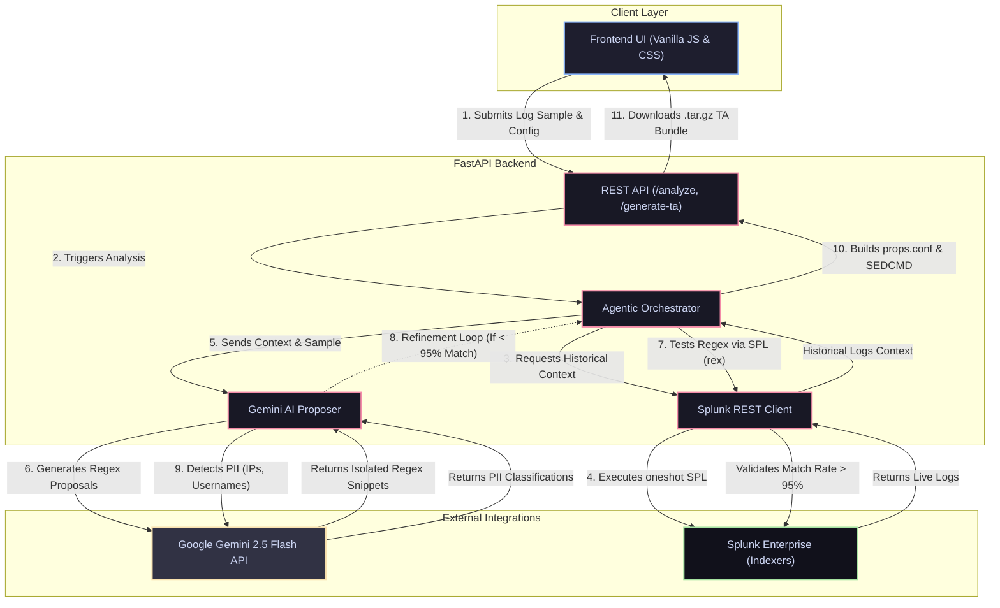

# Splunk LogSmith: The Autonomous Regex Architect

**LogSmith is an autonomous AI agent that leverages configurable AI models and Splunk's native REST APIs to instantly generate, mathematically test, and package production-ready regex extractions into deployable Splunk Technology Add-ons.**
---

## 💡 Inspiration
Data onboarding is arguably the most tedious bottleneck in observability. Creating `props.conf`, writing complex regexes for unstructured logs, masking PII, and bundling Technology Add-ons (TAs) requires deep Splunk expertise and hours of manual testing. Even seasoned engineers often rely on trial-and-error, leading to regexes that quietly fail on edge cases in production. 

We wanted to build an agent that doesn't just "guess" a regex, but actually *acts* like a senior Splunk Architect—writing modular extraction rules, live-testing them against historical Splunk data, and iteratively fixing its own mistakes until it achieves mathematical perfection.

## ⚙️ What it does
LogSmith completely automates the creation of Splunk Technology Add-ons:
1. **Intelligent Field Extraction:** You paste a single raw log line into the beautiful glassmorphism UI.
2. **Contextual Polling:** The backend queries your live Splunk database (via the REST API) to fetch hundreds of historical examples of that exact log format.
3. **Generative Proposals:** Using **Gemini 2.5 Flash**, the agent proposes isolated, highly modular named-capture-group regex snippets.
4. **Autonomous Validation:** The agent takes Gemini's regexes and pushes a live `rex` command back to your Splunk index. It calculates the exact match rate across your historical data.
5. **Self-Healing Loop:** If a regex matches less than 95% of the data, the agent isolates the failed events, feeds them back to Gemini, and autonomously refines the regex until it works.
6. **PII Auto-Masking:** The agent flags sensitive data (IPs, Usernames) and automatically generates Splunk `SEDCMD` masking rules.
7. **One-Click TA Generation:** It instantly bundles `props.conf`, `transforms.conf`, and data models into a downloadable `.tar.gz` package.

## 🛠 How we built it

LogSmith features a highly decoupled, agentic architecture:



### Built With
* **Frontend:** Vanilla HTML/CSS/JS with a premium Glassmorphism design and live-streaming console terminal.
* **Backend:** Python, FastAPI, Uvicorn, and AsyncIO for real-time Server-Sent Events (SSE) streaming.
* **AI:** Google Gemini 2.5 Flash for rapid regex generation and classification.
* **Integrations:** Splunk Native REST API (`/services/search/jobs` & `/services/receivers/simple`).

## ⚠️ Challenges we ran into
* **Hallucinations vs. Reality:** LLMs are notoriously bad at writing perfect regex on the first try. We solved this by forcing Gemini to write isolated snippets instead of massive full-line regexes, and by building the deterministic validation loop that mathematically tests the output against real Splunk data using the formula: $$ Match Rate = \frac{Matched Events}{Total Events} $$
* **API Rate Limits:** During heavy testing, we exhausted our Gemini API free-tier limits. We engineered a highly robust **Heuristic Fallback Engine** built natively into Python that instantly takes over regex generation if the LLM is down, ensuring the agent never crashes in production environments.
* **Splunk Connectivity:** We initially tried to build a custom MCP Server wrapper for Splunk searches, but discovered that bypassing the wrapper and natively executing `oneshot` searches against the Splunk Management port (8089) was significantly faster and more reliable for our validation loops.

## 🏆 Accomplishments that we're proud of
* The self-healing validation loop is incredibly cool to watch in real-time. Seeing the UI stream back `Iteration 1: 96% match`, automatically grab the failed events, send them to Gemini, and return `Iteration 2: 100% match` feels like true autonomous engineering.
* The premium, highly interactive frontend design makes a tedious backend task feel sleek and modern.

## 📖 What we learned
* Large Language Models shouldn't be trusted to write code blindly. By pairing an LLM with a deterministic compiler or database (in this case, Splunk's SPL engine), you can achieve 100% accuracy through autonomous iteration.
* The Splunk REST API is incredibly powerful when used asynchronously via `httpx` in Python.

## 🚀 What's next for Splunk LogSmith
* **Data Models:** Auto-mapping extracted fields to Splunk Common Information Model (CIM) datasets.
* **Transforms Support:** Utilizing Gemini to build `transforms.conf` for complex CSV lookup extractions and heavily routed logs.

## 💻 Try it out
1. Create a virtual environment and install dependencies:
   ```bash
   python -m venv .venv
   source .venv/bin/activate
   pip install -r requirements.txt
   ```
2. Configure your `.env` file with your `GEMINI_API_KEY`.
3. Start the backend:
   ```bash
   python -m uvicorn api.main:app --host 0.0.0.0 --port 8080
   ```
4. Open the UI by navigating to `http://localhost:8080/ui/index.html` in your browser.
