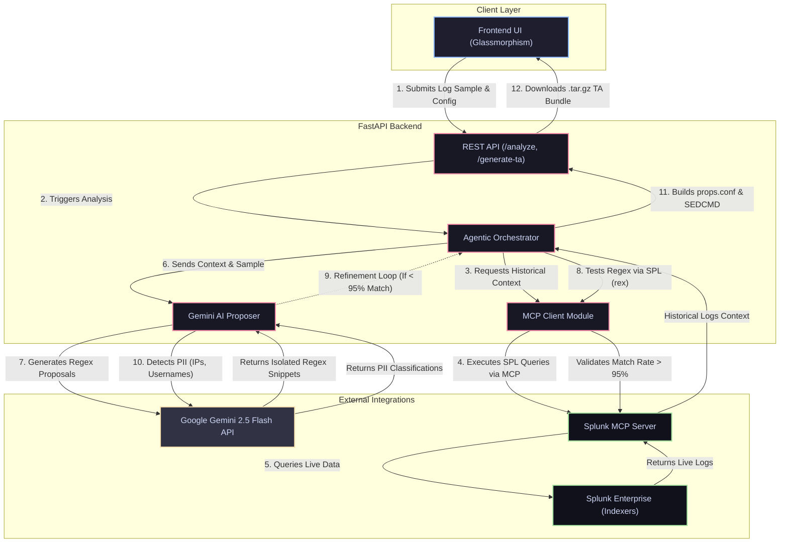

# Splunk LogSmith (Agentic Log Analyzer)

**LogSmith is an autonomous AI agent that uses Gemini and MCP to instantly write, mathematically test, and package perfect regex extractions into ready-to-deploy Splunk Technology Add-ons.**

## The Problem
Data onboarding is one of the most tedious bottlenecks in observability. Creating `props.conf`, writing complex regex for unstructured logs, masking PII, and bundling Technology Add-ons (TAs) requires deep Splunk expertise and hours of manual testing. 

## The Solution
LogSmith acts as an autonomous AI architect. It connects directly to your live Splunk instance using the **Model Context Protocol (MCP)**, pulls real historical logs, uses an LLM to dynamically write and test modular regexes via live `rex` commands, and automatically bundles a ready-to-deploy `.tar.gz` package with PII auto-masking.

## Architecture & Data Flow

Below is the architecture diagram showing how LogSmith interacts with Splunk, Gemini, and the internal components:



### How the AI is Integrated
- **Gemini 2.5 Flash** acts as the core generative brain. The backend Orchestrator prompts Gemini to generate highly specific, isolated `(?P<field>...)` regex snippets instead of massive full-line matches.
- Gemini is also prompted in a final pass to classify any fields containing sensitive data (e.g. `ip_address`, `userName`) so the backend can generate `SEDCMD` masking rules.

### How it Interacts with Splunk
- The application natively uses the **Model Context Protocol (MCP)** to communicate with Splunk. 
- The Orchestrator leverages MCP to run live SPL searches (`search index=main | head 100`) to fetch real data. 
- It also uses MCP to mathematically test the AI's regex against historical logs by pushing the `rex` command directly to the Splunk Search Head, ensuring that large data volumes never have to traverse the network.

### Agentic Loop Data Flow
If a regex proposed by the AI scores less than 95% match rate on the real Splunk data, the Orchestrator isolates the exact log events that failed to match and feeds them *back* to the AI. This creates a fully autonomous, self-healing code loop.

## Setup & Running Locally

1. Create a virtual environment and install dependencies:
   ```bash
   python -m venv .venv
   source .venv/bin/activate
   pip install -r requirements.txt
   ```
2. Configure your `.env` file with your `GEMINI_API_KEY`.
3. Start the backend:
   ```bash
   python -m uvicorn api.main:app --host 0.0.0.0 --port 8080
   ```
4. Open the UI by navigating to `http://localhost:8080/ui/index.html` in your browser.
