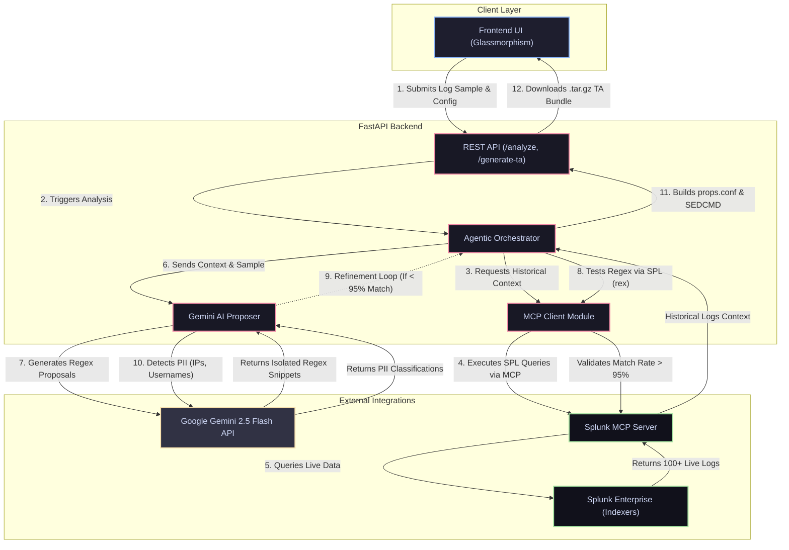

# Splunk LogSmith Architecture

This document outlines the architecture, data flow, and agentic integrations for the Splunk LogSmith (Agentic Log Analyzer) hackathon project.

## High-Level Architecture Diagram

## Key Architectural Highlights

### 1. Model Context Protocol (MCP) Integration
Instead of building a fragile, custom REST wrapper around Splunk, we heavily rely on the **Model Context Protocol (MCP)**. Our backend acts as an MCP Client that speaks directly to a local/remote Splunk MCP Server. 
- **Data Gathering:** It executes live `search index=main | head 100` queries to feed the AI true historical context.
- **Regex Validation:** It offloads the regex testing directly to the Splunk Search Head by running `| rex field=_raw "<ai_regex>"` and evaluating the real match rate without moving gigabytes of logs out of Splunk.

### 2. Autonomous Agentic Loop (The Orchestrator)
The backend does not just "ask an LLM and pray." It acts as a fully autonomous agent:
1. **Propose:** It asks Gemini 2.5 Flash to generate isolated, modular regex snippets for every field it detects in the log sample.
2. **Test:** It connects back to Splunk via MCP to mathematically test those regexes against 100 historical logs.
3. **Refine:** If a regex achieves less than a 95% match rate due to log formatting edge cases, the Orchestrator captures the exact log lines that *failed* to match, sends them back to Gemini, and commands it to refine the regex. It iterates until the 95% threshold is crossed.

### 3. Data Masking & TA Compilation
Once the fields are perfectly extracted, the Agent makes a final pass to Gemini to flag sensitive PII (e.g., classifying an `ip_address` or `userName` field). The backend then dynamically writes a complete, installable Splunk App (`.tar.gz`) containing:
- `props.conf` with `EXTRACT-` rules.
- `SEDCMD` rules for every flagged PII field to mask sensitive data with `[REDACTED]`.
- Proper `app.conf` and directory structures.

### 4. Standalone Fallback Engine
In cases where the MCP connection to Splunk is unavailable, or the Gemini API hits its daily free-tier quota (429 Resource Exhausted), the system gracefully degrades. It uses a local Python-based evaluation engine to validate regexes against the UI's sample, and falls back to a deterministic heuristic engine to keep the application 100% functional for users.
